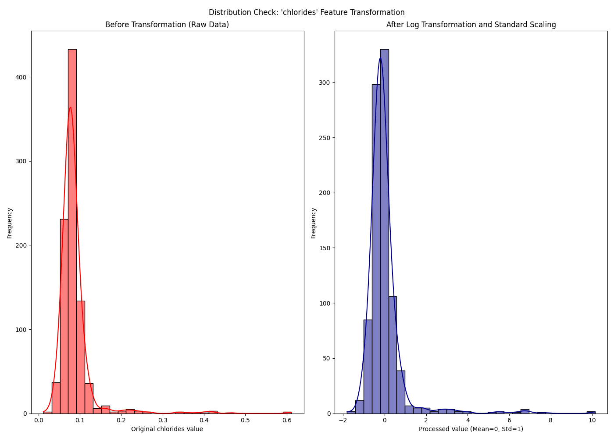
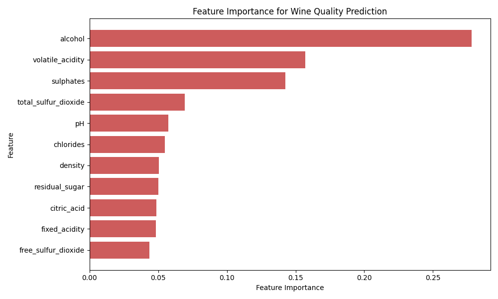

# Predicting Wine Quality Using Random Forest Modeling

This repository contains the complete code for a machine learning project focused on predicting the quality of wine based on 11 physiochemical properties. The project involves an end-to-end data science pipeline, centering on a *Random Forest Regressor* and using *Linear Regression* as a performance benchmark.

## Project Goal

The primary objective was to build and optimize a predictive model capable of estimating a wine's quality score (an integer from 3 to 8) with high accuracy, and to identify which physiochemical properties are the most significant drivers of quality.

## Technical Stack

* **Language:** Python
* **Core Libraries:** `pandas`, `numpy`, `scikit-learn (sklearn)`
* **Visualization:** `matplotlib`, `seaborn` 

---

## Methodology and Pipeline

The project follows a standard machine learning workflow, executed entirely in Python:

1.  **Data Acquisition:** Loaded the Wine Quality dataset (source link below).


2.  **Exploratory Data Analysis (EDA):** Inspected data distributions and checked for missing values.


3.  **Data Preprocessing and Transformation:** Features with significant skewness (e.g., *fixed acidity, residual sugar*) were identified. Comparative histograms were generated to illustrate the distribution of these features before and after scaling/transformation. This step was crucial for preparing the data for modeling.


*Example:*   





4.  **Model Implementation (Random Forest):** A Random Forest Regressor was chosen as the primary model for its ability to capture non-linear relationships.


5.  **Hyperparameter Tuning:** Used Grid Search with Cross-Validation to optimize the Random Forest model for the lowest prediction error.


6.  **Benchmarking (Linear Regression):** A Linear Regression model was trained and evaluated to provide a performance baseline, demonstrating the predictive gain achieved by the ensemble method.


7.  **Evaluation:** Models were evaluated using Root Mean Squared Error (RMSE) and R-squared ($R^2$).

---

## Key Results

The tuned Random Forest model provided the best predictive performance, significantly outperforming the linear baseline.

### Model Performance

| Model | Root Mean Squared Error (RMSE) | R-squared ($R^2$) |
| :--- | :--- | :--- |
| **Random Forest** (Tuned) | **0.5488** Quality Points | **0.4587** |
| Linear Regression (Baseline) | 0.6148 Quality Points | 0.3207 |

### Classification Accuracy

The model's ability to predict the discrete quality score was validated:

* **Exact Match Accuracy:** 68.56%
* **Accuracy within $\pm 1$ Point:** 97.82% (Indication of High Utility)

### Feature Importance Ranking

Analysis of the Random Forest Regressor's feature importance revealed a highly concentrated distribution of predictive power among the chemical properties. 


The top three features (***Alcohol***, *Volatile Acidity*, and *Sulphates*) accounted for a combined 57.7% of the model's total predictive contribution.


| Feature | Importance Score |
| :--- | :--- |
| **alcohol** | **0.278** |
| **volatile\_acidity** | 0.157 |
| **sulphates** | 0.142 |
| total\_sulfur\_dioxide | 0.069 |
| pH | 0.057 |
| ... | ... |




For a Random Forest Regressor, omitting the remaining eight features is not necessary because the algorithm is inherently robust to irrelevant predictors. 

However, this information is useful for adapting to other regression model types that benefit from using fewer features like KNN or SVM. 

---

## How to Run the Project

To replicate this analysis, clone the repository and run the main notebook or script.

1.  **Clone the repository:**
    ```bash
    git clone [https://github.com/crogersbnc/Wine_Quality.git](https://github.com/crogersbnc/Wine_Quality.git)
    cd Wine_Quality
    ```
2.  **Install dependencies:**
    ```bash
    pip install pandas numpy scikit-learn matplotlib seaborn
    ```
3.  **Run the analysis:** Open and execute the main Jupyter Notebook file (check the repo for the exact filename).

## Data Source

The dataset used for this project is the **Red Wine Quality** dataset, publicly available on:
* [Kaggle: Wine Quality Dataset](https://www.kaggle.com/datasets/yasserh/wine-quality-dataset)
* [UCI Machine Learning Repository](https://archive.ics.uci.edu/ml/datasets/wine+quality)